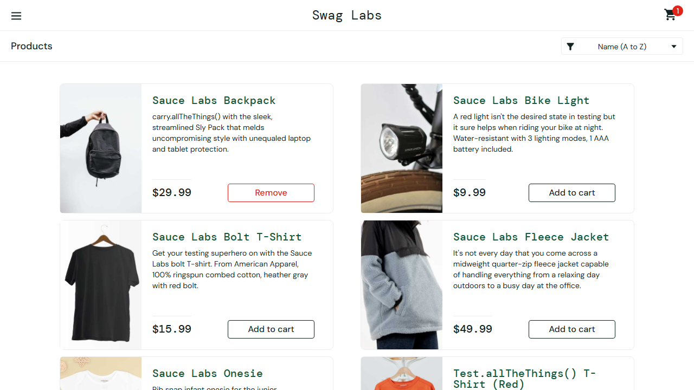

# Playwright E2E Suite — saucedemo.com

[](https://github.com/Mallika23/playwright-e2e-ci/actions/workflows/playwright.yml)

A cross-browser end-to-end test suite in **Playwright + TypeScript** against the demo storefront [saucedemo.com](https://www.saucedemo.com), built with a strict Page Object Model and CI-driven trace/screenshot/video capture on failure.

## What it tests

12 tests across 4 spec files, run against chromium, firefox and webkit:

| Spec | Covers |
|---|---|
| `login.spec.ts` | Valid login lands on inventory; `locked_out_user` shows the "Epic sadface" error banner |
| `add-to-cart.spec.ts` | Adding/removing items, cart badge count (including the zero-items edge case) |
| `checkout.spec.ts` | Full checkout flow through to confirmation; validation errors on missing checkout info |
| `sort.spec.ts` | Name sort (A–Z / Z–A, string comparison) and price sort (low–high, numeric comparison) |

## Architecture

- **Page Object Model** (`pages/`) — one class per screen (`LoginPage`, `InventoryPage`, `CartPage`, `CheckoutStepOnePage`, `CheckoutStepTwoPage`, `CheckoutCompletePage`), plus a `slug.ts` helper for per-product locators. Locators are `readonly` properties built once in the constructor; methods express user intent (`login()`, `addItemToCart()`), never low-level mechanics. **No assertions inside page objects** — every `expect()` lives in the spec files, so both success and failure paths are testable through the same method. A method that navigates to a new screen returns that screen's page object.
- **Locator priority**: `getByRole` > `getByTestId` (via `testIdAttribute: 'data-test'`, since saucedemo uses `data-test` not the Playwright default `data-testid`) > CSS/XPath as a last resort. Zero CSS/XPath selectors in this suite.
- **Config** (`playwright.config.ts`): `baseURL` so specs just call `goto('/')`; `retries: 1` with `trace: 'on-first-retry'`, `screenshot: 'only-on-failure'`, `video: 'retain-on-failure'` — the first attempt runs with no recording overhead, and only a failing test gets rerun with full trace/DOM-snapshot/video capture.
- **Trace-viewer demo** (`tests/demo/`, excluded from the real suite via `testIgnore` in the main config): a standalone test that runs the real login/add-to-cart flow and asserts a deliberately wrong cart count, so it fails predictably on a real element instead of timing out on a broken one. Run it on demand with its own config to regenerate a trace without touching any production page object:
  ```
  npx playwright test --config=playwright.demo.config.ts --headed
  npx playwright show-trace test-results/<path>/trace.zip
  ```



## Running it

```bash
npm ci                                       # install dependencies (matches CI)
npx playwright install --with-deps           # install browser binaries

npx playwright test                          # full suite, all 3 browsers
npx playwright test --project=chromium       # single browser
npx playwright test tests/login.spec.ts      # single file
npx playwright test -g "locked out user"     # single test by name
npx playwright test --ui                     # interactive UI mode

npx playwright show-report                   # open the last HTML report
npx playwright show-trace <path/to/trace.zip> # step through a recorded trace
```

## CI

`.github/workflows/playwright.yml` runs on every push/PR to `main`/`master`: `npm ci` → install browsers → `npx playwright test` across a **matrix of chromium/firefox/webkit** (`fail-fast: false`, so one browser's failure doesn't cancel the others) → uploads a separate `playwright-report-<browser>` artifact per browser so a failure on any one browser ships its own downloadable HTML report.

## Test data

`standard_user` / `secret_sauce` — valid login. `locked_out_user` — triggers the locked-out error banner (`data-test="error"`).

## Tech

Playwright · TypeScript · Node 18+ · Page Object Model · GitHub Actions matrix
